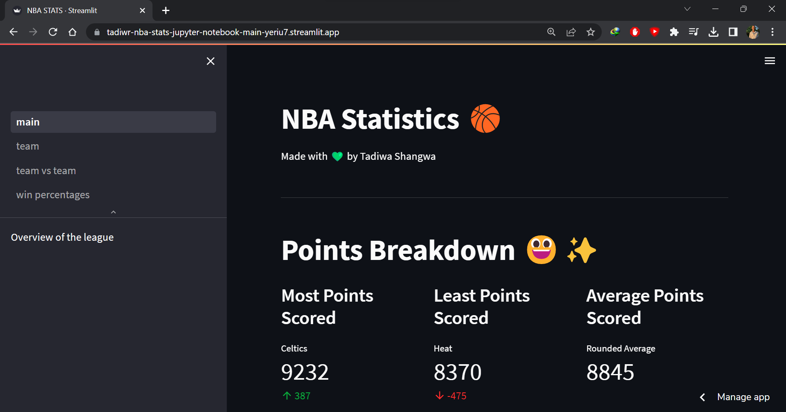

# NBA Statistics Dashboard
by Tadiwanashe Shangwa 🥲

[Check the dashboard out 🎉](https://tadiwr-nba-dashboard-home--z5zmve.streamlit.app/)

This is a dashboard that visualizes nba statistics. On the date of release its nothing much but overtime it will get better. If you want to contribute to this dashboard hit me up and let me know!

---------------------------

## Dependencies

Dependencies can be downloaded at once by running the following command. Make sure you download all dependencies if you wish to fork this repository 🥲

    pip install -r requirements.txt

- pandas
- streamlit
- matplotlib
- multipledispatch
- IPython

-------------------

## Running the app

The dashboard is streamlit web app. Inorder to run it you need to install streamlit. Run the followong command to do so

    pip install streamlit

The main file for the dashboard is [main.py](main.py). Run the following command to launch the dashboard

    streamlit run main.py

------
## The Dashboard

## How it works?

- Data on NBA teams is fetched from an api inform of json
- The json is then enconded into a pandas dataframe
- The dataframe is then turned into a csv file thats stored in the static folder directory as a form of cache
- since stats change from game to game, the data is fetched on a daily basis

Check the code for more! 
